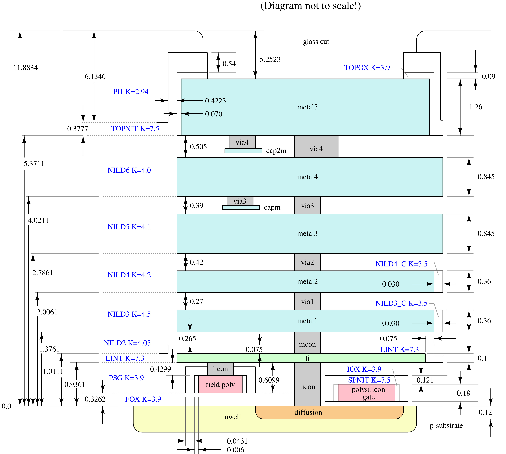
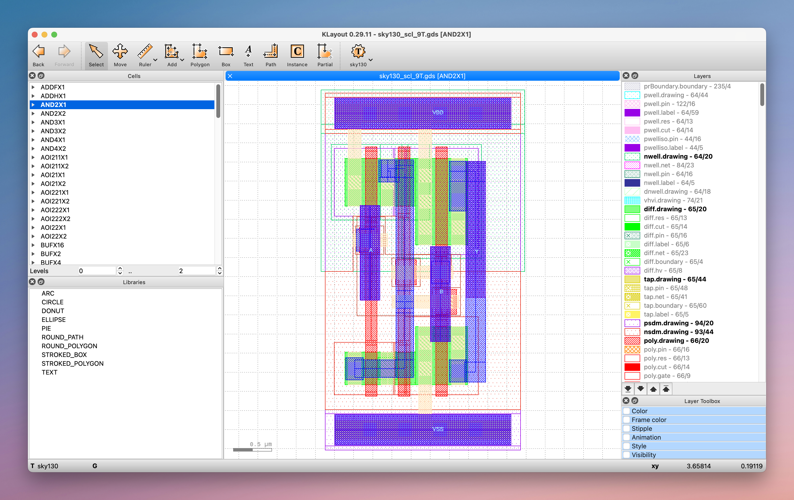
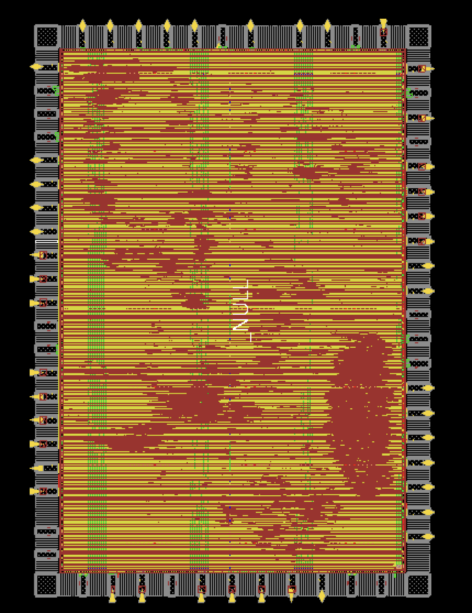
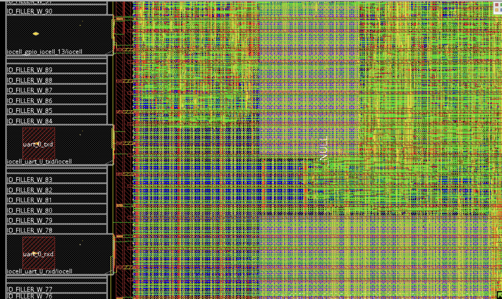
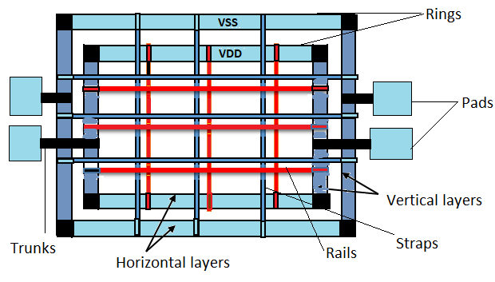
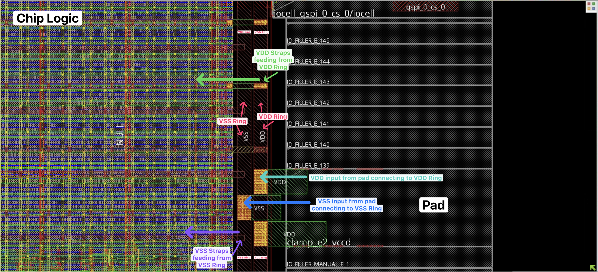

# Lab 5: Physical Design

We've spent the last labs and lectures diving into all of the awesome infrastructure available for designing SoCs,
taking you from Chisel, a higher-level HDL embedded in Scala, all the way through composable SoC components abstracted behind config fragments.

One large consideration remains, however:
how do we make this all real?

The course, so far, has been concerned with the generation & writing of RTL, which is a **behavioral description** of what we want our circuit to do.
There are no polygons, no timing paths, just _intent_. 

Physical design, which will be explored in this lab, is the process of taking that intent (RTL) and turning it into an equivalent (but manufacturable) physical layout!

This lab will contain some theory, they mainly act as supplemental to the lecture material and can be also used as reference. If you know what is going on for a particular topic from lecture coverage, feel free to skip those theory sections, otherwise **please read the theory sections; otherwise you may find yourself to be very lost in later sections**. (Also these theory sections contain information that can frequently come up in a PD interview... So information might be good to know anyways :p)

# EECS151LA Review
EECS151LA's lab 4 has a very well-written overview on [PaR](https://github.com/EECS150/asic-labs-sp24/tree/main/lab4).
We highly encourage you read the lab's prose (and not just skip to the questions like you might have if/when you took the course). 
For the sake of ensuring that everyone is on the same page, some of the following content will be repeated from EECS151-LA lab 4 (or other labs), and some might look similar but be a little bit different from what you saw in EECS151.

# [FYI] Theory: CAD Tooling
VLSI/PD uses lots of tools and tools have unintuitive names. Here is a table. Very similar to what you probably saw in EECS151, but updated to be more complete.
[Aside: the following technically includes simulation tools, which technically is not part of PD, but this is good information to have.]

The big 3 EDA (Electronic Design Automation) companies are Cadence, Synopsys, and Siemens. Together, they pretty much hold 100% of the market share for the VLSI EDA space.

|  | Synopsys | Cadence | Siemens | Open-Source
|---|---|---|---|---|
| RTL Simulation | VCS* | Xcelium | Questa (formerly Mentor ModelSim) | Icarus Verilog, Verilator
| RTL-Power | PrimePower RTL, SpyGlass | Joules | PowerPro-RTL | - |
| Synthesis | FusionCompiler (Design Compiler) | Genus | Oasys-RTL | Yosys Open Synthesis Suite
| Place & Route | FusionCompiler (IC Compiler II) | Innovus | Aprisa | OpenROAD | 
| Physical Layout (for Full Custom Analog/Digital), Analog/Mixed-Signal IC | Custom Compiler | Virtuoso | L-Edit^ | - |
| Gate Level Power | PrimePower | Voltus | PowerPro | - |
| DRC/LVS/Physical Verification | IC Validator | Pegasus | Calibre | Magic [Developed at Berkeley!], KLayout
| Parasitic Extraction (PEX) & Signoff | [Synopsys Signoff](https://www.synopsys.com/implementation-and-signoff/signoff.html#products) | [Certus Closure Solution](https://www.cadence.com/en_US/home/resources/datasheets/cadence-certus-closure-solution-ds.html) (Includes Innovus, Pegasus, Quantus & Tempus) | Calibre | OpenRCX, KLayout

\* Note about VCS: VCS is the simulator, the waveform viewer you may have used in EECS151 is called DVE (≠VCS). DVE is old, industry primarily now uses [Verdi](https://www.synopsys.com/verification/debug/verdi.html) for waveform viewing (photo [here](./Lab_5_assets_rewrite/verdi.png)) if they are in the Synopsys ecosystem for RTL simulation. 

^ Note about L-Edit: you might also see names such as Tanner L-Edit or Mentor L-Edit - They are the same thing.

# Theory: The SkyWater 130nm PDK & Standard Cells
You might've used the SkyWater 130nm PDK in EECS151 if you took the ASIC lab, however, the lab specs don't fully cover everything about the PDK you need to know for a successful tapeout; so this is the supplemental to it.

First, a clarification: a PDK (Process Development Kit) typically includes the process technology data, process primatives, DRC and LVS decks; however, depending on the supplier, they might not include digital standard cell libraries.
* Process/Technology here refers to SkyWater 130nm. There are many different processes/technologies: SkyWater 90nm, GlobalFoundries 180nm, Intel 16 (AKA: Intel 22FFL), TSMC 16, etc.
* Process primatives here refers to symbols, device parameters, Parameterized Cells (PCells) for analog design; Technology data means SPICE models for transistors, capacitors, resisters, inductors, etc.
* Standard Cells here refer to basic digital logic blocks such as AND, OR, NOR gates in prebuilt blocks supplied by the foundry for building digital designs. For more see [A Closer Look at the Standard Cells](#a-closer-look-at-the-standard-cells).

To prevent any confusion, we will refer to **PDKs as the process primatives** and **Standard Cells as the digital standard cell library**.

## SkyWater 130nm Stackup


Every PDK has a document or drawing similar to the one above. It is a documentation from the foundry describing how materials (like Silicon, Oxides, Metals) are stacked up in that manufacturing process. It also contains specifications that dictate the thickness of each metal layer, the distance required between metal layers, etc. 

For the most part, you do not need to completely understand the diagram. While violating the parameters on this diagram (ex: misconfiguring the minimum distance between metal layers in your VLSI tool setup) will result in DRC violations or errors during the place & route flow, those errors will give you more information on a) what numbers to look for, b) where to look for them, c) what the numbers you are looking at do and how they affect your VLSI flow.

Your job here is to understand and build a mental image of this process. When you see the layer "metal 1" you should know that the "li" (local interconnect) is right below it and that there is a connection "mcon" (metal contact) connecting them together. 

You should start building this intuition so that when you see, for example, an error saying two pieces of metal are placed too close to each other near `via M1M2_PR_R`, you know to turn off all other layers other than Metal 1, Metal 2 and Via 1 in Innovus. Having the stack up in your head and being able to figure out what layers to look at vs. to disregard will make your PD life a lot easier since you can quickly triangulate a problem to a few limited sections of your chip and ignore the other overwhelming amounts of information. 

Additionally, developing the intuition that a chip is like a layered cake/city and that signals coming from the outside world will be introduced to the chip at higher metal layers and will need to be routed down through the metal layer stack to contact the transistors, and vice-versa -- signals from the transistors that need to travel to another part of the chip or to the outside world (off chip) will need to be moved up from the bottom of the chip (where the transistors are located) through the metal layers.

<details>
<summary>I tried including as much as I know about the acroymns in the photo here if you are curious:</summary>
nwell -> section of the substrate that has been n-type doped
licon -> local interconnect contact
li -> local interconnect
mcon -> metal contect 

FOX K=3.9 -> Field Oxide (SiO2), Dielectric Constant = 3.9
PSG -> Phosophosilicate Glass (Doped with phosphorus)
SPNIT -> Silicon Nitride Spacer
IOX -> I/O (aka: Gate) Oxide
</details>

## A Closer Look at the Standard Cells
Standard Cells are the fundamental building blocks of a digital design containing fundemental logic blocks such as AND, NOT, OR gates, Clock Buffers, Muxes, etc. They are placed and connected up in a digital design to build the logic that you have described in your Verilog/Chisel. 



Here is a SkyWater 130nm Standard Cell. This one in particular represents a 2-input AND gate (named: `AND2X1` -- do you remember seeing something like this in your EECS151 ASIC post-synthesis netlist?)

### Characterizing a Standard Cell: Describing it to the VLSI tools
We have this nice visual graphic of the standard cell, however, we need to tell the CAD tools a bit more -- where are the input ports of this cell? where are the output ports? where to connect power to? groud? how big is the cell? etc...

Given 1 standard cell like the AND2X1 above, there are different "views" of that standard cell. Looking at `/home/ff/ee198/ee198-20/sky130_col/sky130_scl_9T_0.1.2/sky130_scl_9T` we see the following folders:

```bash
$> ls /home/ff/ee198/ee198-20/sky130_col/sky130_scl_9T_0.1.2/sky130_scl_9T

$> cdl  dspf  gds  lef  lib  oa  pgv  spectre  verilog
```

**CDL: Circuit Design Language**
* A netlist description of the standard cell, usually generated by a tool from the schematic of that standard cell when it was designed.
* It is similar to a SPICE netlist and is used in circuit simulation and **LVS** (will discuss later)
    <!-- TODO: LINK LVS SECTION -->
    ```
    1 ************************************************************************
    2 * Library Name: sky130_scl_9T
    3 * Cell Name:    AND2X1
    4 * View Name:    schematic
    5 ************************************************************************

    6 .SUBCKT AND2X1 A B Y VDD VSS
    7 *.PININFO A:I B:I VDD:I VSS:I Y:O
    8 Mmn2 Y n0 VSS VSS nfet_01v8 W=760n L=150n M=1
    9 Mmn0 net127 B VSS VSS nfet_01v8 W=425n L=150n M=1
    10 Mmn1 n0 A net127 VSS nfet_01v8 W=425n L=150n M=1
    11 Mmp1 n0 B VDD VDD pfet_01v8 W=625n L=150n M=1
    12 Mmp0 n0 A VDD VDD pfet_01v8 W=625n L=150n M=1
    13 Mmp2 Y n0 VDD VDD pfet_01v8 W=1.13u L=150n M=1
    14 .ENDS
    ```
* For that sane `AND2X1` cell:
    * Line 6 & 7 describes its ports `A` (Input), `B` (Input), `Y` (Output), `VDD` (Input), `VSS` (Input)
    * Line 8-13 describes physically how the standard cell is built, including the width & lengths of the MOSFETs used.

**DSPF: Detailed Standard Parasitic Format**
* Detailed model of RC parasitics for every net in the standard cell in SPICE like format -- and mainly used for SPICE sims. 

**GDS: Graphical View**
* This is that photo/screenshot above

**LEF: Library Exchange Format**
* These contain information regarding each standard cell (or broadly, each macro/logic block that can be placed)
    * "information" = Cell name, a placement site that the specific standard cell can be placed at, XY-coordinates defining the origin of the standard cell, size of the cell, pin information (the cell's I/O).

There are 2 LEF files for the Standard Cells in SKY130:
* `/home/ff/ee198/ee198-20/sky130_col/sky130_scl_9T_0.1.2/sky130_scl_9T/lef/sky130_scl_9T.lef`
* `/home/ff/ee198/ee198-20/sky130_col/sky130_scl_9T_0.1.2/sky130_scl_9T_tech/lef/sky130_scl_9T_phyCells.lef`
    * This LEF houses information for some of the Special Cells we will explain in the [following section](#special-cells--blocks-fillers-taps-power-on-reset-por).

<details>
<summary>Detailed line-by-line explanations of the LEF</summary>

```
1     MACRO AND2X1
2     CLASS CORE ;
3     ORIGIN 0 0 ;
4     FOREIGN AND2X1 0 0 ;
5     SIZE 2.3 BY 4.14 ;
6     SYMMETRY X Y ;
7     SITE CoreSite ;
8     PIN A
9         DIRECTION INPUT ;
10        USE SIGNAL ;
11        ANTENNAMODEL OXIDE1 ;
12        ANTENNAGATEAREA 0.1575 LAYER met1 ;
13        ANTENNAMAXAREACAR 0.674603 LAYER met1 ;
14        ANTENNAMAXSIDEAREACAR 0.793651 LAYER met1 ;
15        PORT
16        LAYER met1 ;
17            RECT 0.33 1.695 0.59 2.935 ;
18            RECT 0.285 2.335 0.59 2.625 ;
19        END
20    END A
21    PIN B
22        DIRECTION INPUT ;
23        USE SIGNAL ;
24        ANTENNAMODEL OXIDE1 ;
25        ANTENNAGATEAREA 0.1575 LAYER met1 ;
26        ANTENNAMAXAREACAR 1.052381 LAYER met1 ;
27        ANTENNAMAXSIDEAREACAR 1.238095 LAYER met1 ;
28        PORT
29        LAYER met1 ;
30            RECT 1.25 1.155 1.51 2.395 ;
31        END
32    END B
33    PIN VDD
34        DIRECTION INPUT ;
35        USE POWER ;
36        SHAPE ABUTMENT ;
37        NETEXPR "VDD VDD!" ;
38       PORT
39        LAYER met1 ;
40            RECT 0 3.94 2.3 4.34 ;
41        END
42    END VDD
43    PIN VSS
44        DIRECTION INPUT ;
45        USE GROUND ;
46        SHAPE ABUTMENT ;
47        NETEXPR "VSS VSS!" ;
48        PORT
49        LAYER met1 ;
50            RECT 0 -0.2 2.3 0.2 ;
51        END
52    END VSS
53    PIN Y
54        DIRECTION OUTPUT ;
55        USE SIGNAL ;
56        ANTENNADIFFAREA 0.50085 LAYER met1 ;
57        PORT
58        LAYER met1 ;
59            RECT 1.495 2.86 1.97 3.51 ;
60            RECT 1.71 0.625 1.97 3.51 ;
61            RECT 1.495 0.625 1.97 0.915 ;
62        END
63    END Y
64    OBS
65        LAYER met1 ;
66        RECT 0.575 3.24 1.03 3.53 ;
67        RECT 0.8 0.685 1.03 3.53 ;
68        RECT 0.145 0.655 0.375 0.945 ;
69        RECT 0.145 0.685 1.03 0.915 ;
70    END
71    PROPERTY CatenaDesignType "deviceLevel" ;
72    END AND2X1
```
* Line 2 specifies the location that 
</details>


### Special Cells & Blocks: Fillers, Taps, Power on Reset (PoR)

### Characterizing the entire Process/Technology: Technology LEFs

# Theory: Inputs/Outputs of each VLSI Step
We've heard about the different tools for each step... What do these tools take in terms of input & what do they output? This section should help you understand flow of how your design goes from RTL to a GDS.

A thing to keep in mind: These tools are controlled by a scripting language called TCL (pronounced "tickle"). Each tool has its own set of commands that can be called within a TCL file. These commands are the primary way digital designers control these VLSI tools. These commands look like terminal commands where you have a command like `cp`, followed by some flags and arguments. TCL files have the file extension `.tcl`. We will talk about how to write TCL to control these tools in a later section; this is just a heads up so you don't get confused when you see these commands in the following few sections.

## Synthesis
Broadly, synthesis follows the following flow:

If you would like some code as reference, the synthesis TCL script can be found at the following location (after running synthesis at least once):
`${CY}/vlsi/build/chipyard.harness.TestHarness.<your config>-ChipTop/syn-rundir/syn.tcl`

### 1. Write/Generate SDCs
SDCs or Synopsys Design Constraint files should either be manually written or generated by some tool.

SDC files contain design timing information (special cases, restrictions, etc), creation of clocks (and clock dividers, clock inverters, etc), I/O pin constraints such as defining external load capacitance connected to a top level port, among other things. (For more detail, read [this](https://signoffsemiconductors.com/introduction-to-sdc/)).


<!-- TODO: give example of actual hammer yaml -->
At Berkeley, we have a tool called [Hammer](https://hammer-vlsi.readthedocs.io/) that generates the SDC commands for us, and automatically writes them to a SDC file according a some specifications we defined in a [YAML](https://en.wikipedia.org/wiki/YAML#Example) configuration file. We will discuss Hammer in a later section, but if you are curious, the source code that generates these SDC commands is [here](https://github.com/ucb-eecs151tapeout/ofot-hammer/blob/0f5388ed185e52254bfabe7c127b73aedfd26d90/hammer/vlsi/hammer_vlsi_impl.py#L2183-L2284).

You can find the SDCs your synthesis process used at `${CY}/vlsi/build/chipyard.harness.TestHarness.<someConfig>-ChipTop/syn-rundir/clock_constraints_fragment.sdc` and `${CY}/vlsi/build/chipyard.harness.TestHarness.<someConfig>-ChipTop/syn-rundir/pin_constraints_fragment.sdc`

### 2. Write/Generate MMMC (Multi-mode, Multi-corner) Views, then read in MMMC files
The process of doing this at a high level is:
1. Read SDC Files
2. Read in `.lib` files
3. Create MMMC corners

.lib files: Liberty Timing Files are timing libraries generated by the foundry that contains timing, area and power information for standard cells.

For the SkyWater 130nm Process, Liberty Timing Files can be found at `/home/ff/ee198/ee198-20/sky130_col/sky130_scl_9T_0.1.2/sky130_scl_9T/lib`. Each file represents a different corner -- for what this means, see the following paragraph.

MMMC Corners: Multi-mode, Multi-corner views attempt to cover all real world environments where your chip may be used in, then provide this information to the tool, so it can accurately provide timing information.
Modes are defined by different functional modes that your chip will operate in (high-performance, low-power, etc.) -- This is reflected by different supply voltages and timing constraints.
Corners represent a set of data that attempts to capture variations in the manufacturing process (specifically higher and lower carrier mobilities in NMOS & PMOS -- Read more [here](https://en.wikipedia.org/wiki/Process_corners#FEOL_corners)) and how they will impact performance of the chip, along with how variations in voltage and temperature of the surrounding environment that your chip will operate in will change timing and other parameters.

You can find the script that your synthesis run used to generate MMMC corners at `${CY}/vlsi/build/chipyard.harness.TestHarness.<someConfig>-ChipTop/syn-rundir/mmmc.tcl`

### 3. Read in LEF files
LEF files includes rules and specifications about the standard cells and metal interconnects. Both Standard Cell LEFs and Technology LEFs are read in at this stage.

If you are not sure what these terms mean, refer to the [Characterizing a Standard Cell: Describing it to the VLSI tools](#characterizing-a-standard-cell-describing-it-to-the-vlsi-tools) section.

**Technology LEFs -- "Tech LEFs" -- ".tlefs"**
* These contain information regarding the process as a whole (information about the stackup) -- diffusion layer, poly-silicon layer, metal interconnect information, Via information, possible placement sites ("classes") and their dimensions.
    * "information" = minimum spacing between metal lines, via width, spacing requirements, sheet resistance information for different metal layers and vias.

The technology LEF for the SkyWater 130nm Process can be found at `/home/ff/ee198/ee198-20/sky130_col/sky130_scl_9T_0.1.2/sky130_scl_9T_tech/lef/sky130_scl_9T.tlef`. Take a look!

### 4. Read in RTL
This step is pretty simple: the synthesis tool reads in all of the RTL that makes up your design! One of these files should be your top-level Verilog file.

### 5. Sanity Checks
The tool then runs a sanity check on the design and timing specifications. 
This involves making sure that there is no combinational loops, multidriven nets, etc and that there are no missing clock definitions, missing information for the I/O ports, multi-clock driven registers, etc.

### 6. Generic Mapping
In EECS151 Lab 3's words:
> This step is the generic synthesis step. In this step, [the synthesis tool] converts our RTL read in the previous step into an intermediate format, made up of technology-independent generic gates. These gates are purely for gate-level functional representation of the RTL we have coded, and are going to be used as an input to the next step. This step also performs logical optimizations on our design to eliminate any redundant/unused operations.

For Cadence Genus, this step is identifiable by the command `syn_generic` being run.

### 7. Technology Mapping
> This step is the mapping step. [The synthesis tool] takes its own generic gate-level output and converts it to [technology]-specific gates. This step further optimizes the design given the gates in our technology. That being said, this step can also increase the number of gates from the previous step as not all gates in the generic gate-level Verilog may be available for our use and they may need to be constructed using several, simpler gates.

For Cadence Genus, this step is identifiable by the command `syn_map` being run.

### 8. Optimization
Optional step, where the TCL command `syn_opt` is called for the tool to perform some further optimizations. 

### 9. Add Tieoffs
> In some designs, the pins in certain cells are hardwired to 0 or 1, which requires a tie-off cell. This step adds these cells.

Here is an example of the TCL script telling Cadence Genus which gates/standard cells are to be used for tieoff, and then calling Genus to add the tieoffs:

```
set HI_TIEOFF [get_db base_cell:TIEHI .lib_cells -if { .library.library_set.name == $ACTIVE_SET }]

set LO_TIEOFF [get_db base_cell:TIELO .lib_cells -if { .library.library_set.name == $ACTIVE_SET }]

add_tieoffs -high $HI_TIEOFF -low $LO_TIEOFF -max_fanout 1 -verbose
```

### 10. Generate Reports
> Generates post-synthesis reports on area, utilization, timing, runtime, etc

Note: Most of these reports will not be particularly accurate since they don't take into account routing congestion, wire delay, clock tree delays and clock skew, which the Place & Route flow takes into account. So post-synthesis reports should be used for a ball park reference only.

### 11. Write outputs
Writes the results of the synthesis flow. This includes gate-level Verilog, a SDC file for the post-synthesis design, a .sdf (Standard Delay Format) file containing timing information (path delays, timing constraints for checks)

Here is the TCL (note, paths are different here) for writing the 3 different output files:

```
write_hdl > ${CY}/vlsi/build/chipyard.harness.TestHarness.<your config>-ChipTop/syn-rundir/ChipTop.mapped.v

write_sdc -view ss_100C_1v60.setup_view > ${CY}/vlsi/build/chipyard.harness.TestHarness.<your config>-ChipTop/syn-rundir/ChipTop.mapped.sdc

write_sdf > ${CY}/vlsi/build/chipyard.harness.TestHarness.<your config>-ChipTop/syn-rundir/ChipTop.mapped.sdf
```

You can view the 3 written files at the file paths above as specified in the TCL script.

## Place & Route

Continuing from synthesis, here is what is involved in the Place & Route process:

The reference TCL script is available here: `${CY}/vlsi/build/chipyard.harness.TestHarness.<your config>-ChipTop/par-rundir/par.tcl`

This section will heavily rely on you reading [EECS151 ASIC Lab 4's Place and Route section](https://github.com/EECS150/asic-labs-sp24/tree/main/lab4#place-and-route). If you haven't read it before or forgot the contents, please re-read it.

### 1. Read LEFs
* Reading in Standard Cell & PDK LEFs - See [this section](#3-read-in-lef-files).

### 2. Read MMMC
* See [this section](#2-writegenerate-mmmc-multi-mode-multi-corner-views).

### 3. Init Design
Initializes the design with context of your synthesized Verilog netlist, LEF, name of power net, name of ground net, CPF file, MMMC file.

### 4. Tool Settings
A series of commands that tell Innovus to behave a certain way during the flow (when it runs placement, optimization, CTS, routing, etc).

<details>
<summary>If you are interested, here is the TCL:</summary>

    ```
    ##########################################################
    # Placement attributes  [get_db -category place]
    ##########################################################
    #-------------------------------------------------------------------------------
    set_db place_global_place_io_pins  true

    set_db opt_honor_fences true
    set_db place_detail_dpt_flow true
    set_db place_detail_color_aware_legal true
    set_db place_global_solver_effort high
    set_db place_detail_check_cut_spacing true
    set_db place_global_cong_effort high
    set_db place_detail_use_check_drc true
    set_db place_detail_check_route true
    set_db add_fillers_with_drc false

    ##########################################################
    # Optimization attributes  [get_db -category opt]
    ##########################################################
    #-------------------------------------------------------------------------------

    set_db opt_fix_fanout_load true
    set_db opt_clock_gate_aware false
    set_db opt_area_recovery true
    set_db opt_post_route_area_reclaim setup_aware
    set_db opt_fix_hold_verbose true

    ##########################################################
    # Clock attributes  [get_db -category cts]
    ##########################################################
    #-------------------------------------------------------------------------------
    set_db cts_target_skew 0.03
    set_db cts_max_fanout 10
    #set_db cts_target_max_transition_time .3
    set_db opt_setup_target_slack 0.10
    set_db opt_hold_target_slack 0.10

    ##########################################################
    # Routing attributes  [get_db -category route]
    ##########################################################
    #-------------------------------------------------------------------------------
    set_db route_design_antenna_diode_insertion 1
    set_db route_design_antenna_cell_name "ANTENNA"

    set_db route_design_high_freq_search_repair true
    set_db route_design_detail_post_route_spread_wire true
    set_db route_design_with_si_driven true
    set_db route_design_with_timing_driven true
    set_db route_design_concurrent_minimize_via_count_effort high
    set_db opt_consider_routing_congestion true
    set_db route_design_detail_use_multi_cut_via_effort high
    ```
</details>

You most likely won't know what each individual command does -- and that is OK! We as staff don't even remember. Luckily there is a manual that tells you what these things do. We will cover how to read this (very long) manual in the [TCL Scripting Applied] Section.

### 5. Read Power intent
> Reads in CPF file [Common Power Format] A CPF file contains information about power domains in the design (voltage, names, groups, etc)

You can take a look at the CPF that our flow reads in at `${CY}/vlsi/build/chipyard.harness.TestHarness.<your config>-ChipTop/par-rundir/power_spec.cpf` after your first Place & Route run. You will see that it is creating different power nets (1.8v, 3.3v), connecting IO cells that take in power to the correct power domains, assigning specific IO cell pins to different power nets.

### 6. IO Fillers
For our IC design, I/O cells are found at the {top, left, right, bottom} edges of the chip in order to allow our chip to interface with the outside world. 
^ If this concept is foreign to you, see the first photo in the [Floorplanning section of EECS151-LA Lab 4](https://github.com/EECS150/asic-labs-sp24/tree/main/lab4#floorplanning).

However, it is not a great idea to have our I/O cells directly touching each other (exercise for the reader: why?*). So we need to insert special "I/O fillers" between the different I/O cells. What this exactly looks like on our chip is best illustrated with photos:

1. Overview of our entire chip/"die" (just to give you some context -- this view should be familiar to you already from EECS151 ASIC Lab 4)



2. If you look towards the left of the photo & we zoom in, you can see the IO cells and IO fillers and how they fit together:




\*: Electrically speaking, it makes keeping the circuitary of each IO cell separate a lot more difficult, and this may result in unintended shorts, unintended crossing of power domains, etc. From a physical perspective, having each IO port be so close to the other ones can cause problems/difficulty when we attempt to connect wires to the chip to interact with the other components off chip. We'll discuss more how exactly our chip is connected with components off chip in the [die area, io rings, available area, packaging overview] section.

### 7. Add Core (Power) Rings to Chip
We then draw a ring around our chip, between the actual wires/logic and our IO cells. This ring carries power and ground signals around the chip, so that we can use it as a source for when we draw our horizontal and vertical power straps across our chip. We will talk about why we need these horizontal & vertical power straps in the next section, but the tl;dr is: it enables us to get power to each standard cell, or logic that requires power.

Conceptual photo, the ring that is labeled "Rings" is what this step of P&R draws:



Here is a photo from an actual SkyWater 130nm design that shows the Core Ring, how power is fed into it and how power is drawn from it for the rest of the chip's logic:



### 8. Draw power straps

/scratch/jfx/barduino-ofot/vlsi/build/chipyard.harness.TestHarness.BarduinoConfig-ChipTop/par-rundir/power_straps.tcl

### 9. Place IO Cells, Promote Top Level I/O Pins

### 10. Place Opt Design

### 11. Set CTS Buffer & Clock Gating Cells, Perform CTS (ccopt_design)

### 12. Route Design

### 13. Opt Design

### 14. Add Fillers

### 15. GDS Stream Out


## DRC


## LVS