# Lab 5: Physical Design

We've spent the last labs and lectures diving into all of the awesome infrastructure available for designing SoCs,
taking you from Chisel, a higher-level HDL embedded in Scala, all the way through composable SoC components abstracted behind config fragments.

One large consideration remains, however:
how do we make this all real?

The course, so far, has been concerned with the generation & writing of RTL, which is a **behavioral description** of what we want our circuit to do.
There are no polygons, no timing paths, just _intent_.

Physical design, which will be explored in this lab, is the process of taking that intent (RTL) and turning it into an equivalent (but manufacturable) physical layout!

This lab will contain some theory, they mainly act as supplemental to the lecture material and can be also used as reference. If you know what is going on for a particular topic from lecture coverage, feel free to skip those theory sections, otherwise **please read the theory sections; otherwise you may find yourself to be very lost in later sections**. 

# EECS151LA Review
EECS151LA's lab 4 has a very well-written overview on [PaR](https://github.com/EECS150/asic-labs-sp24/tree/main/lab4).
We highly encourage you read the lab's prose (and not just skip to the questions like you might have if/when you took the course).
For the sake of ensuring that everyone is on the same page, some of the following content will be repeated from EECS151-LA lab 4 (or other labs), and some might look similar but be a little bit different from what you saw in EECS151.

# [FYI] Theory: CAD Tooling
VLSI/PD uses lots of tools and tools have unintuitive names. Here is a table. Very similar to what you probably saw in EECS151, but updated to be more complete.
[Aside: the following technically includes simulation tools, which technically is not part of PD, but this is good information to have.]

The big 3 EDA (Electronic Design Automation) companies are Cadence, Synopsys, and Siemens. Together, they pretty much hold 100% of the market share for the VLSI EDA space.

|  | Synopsys | Cadence | Siemens | Open-Source
|---|---|---|---|---|
| RTL Simulation | VCS* | Xcelium | Questa (formerly Mentor ModelSim) | Icarus Verilog, Verilator
| RTL-Power | PrimePower RTL, SpyGlass | Joules | PowerPro-RTL | - |
| Synthesis | FusionCompiler (Design Compiler) | Genus | Oasys-RTL | Yosys Open Synthesis Suite
| Place & Route | FusionCompiler (IC Compiler II) | Innovus | Aprisa | OpenROAD (OpenLANE for SkyWater 130nm) |
| Physical Layout (for Full Custom Analog/Digital), Analog/Mixed-Signal IC | Custom Compiler | Virtuoso | L-Edit^ | - |
| Gate Level Power | PrimePower | Voltus | PowerPro | - |
| DRC/LVS/Physical Verification | IC Validator | Pegasus | Calibre | Magic [Developed at Berkeley!], KLayout
| Parasitic Extraction (PEX) & Signoff | [Synopsys Signoff](https://www.synopsys.com/implementation-and-signoff/signoff.html#products) | [Certus Closure Solution](https://www.cadence.com/en_US/home/resources/datasheets/cadence-certus-closure-solution-ds.html) (Includes Innovus, Pegasus, Quantus & Tempus) | Calibre | OpenRCX, KLayout

\* Note about VCS: VCS is the simulator, the waveform viewer you may have used in EECS151 is called DVE (≠VCS). DVE is old, industry primarily now uses [Verdi](https://www.synopsys.com/verification/debug/verdi.html) for waveform viewing (photo [here](./Lab_5_assets_rewrite/verdi.png)) if they are in the Synopsys ecosystem for RTL simulation.

^ Note about L-Edit: you might also see names such as Tanner L-Edit or Mentor L-Edit - They are the same thing.

# Theory: The SkyWater 130nm PDK & Standard Cells
You might've used the SkyWater 130nm PDK in EECS151 if you took the ASIC lab, however, the lab specs don't fully cover everything about the PDK you need to know for a successful tapeout; so this is the supplemental to it.

First, a clarification: a PDK (Process Development Kit) typically includes the process technology data, process primatives, DRC and LVS decks; however, depending on the supplier, they might not include digital standard cell libraries.
* Process/Technology here refers to SkyWater 130nm. There are many different processes/technologies: SkyWater 90nm, GlobalFoundries 180nm, Intel 16 (AKA: Intel 22FFL), TSMC 16, etc.
* Process primatives here refers to symbols, device parameters, Parameterized Cells (PCells) for analog design; Technology data means SPICE models for transistors, capacitors, resisters, inductors, etc.
* Standard Cells here refer to basic digital logic blocks such as AND, OR, NOR gates in prebuilt blocks supplied by the foundry for building digital designs. For more see [A Closer Look at the Standard Cells](#a-closer-look-at-the-standard-cells).

To prevent any confusion, we will refer to **PDKs as the process primatives** and **Standard Cells as the digital standard cell library**.

## SkyWater 130nm Stackup


Every PDK has a document or drawing similar to the one above. It is a documentation from the foundry describing how materials (like Silicon, Oxides, Metals) are stacked up in that manufacturing process. It also contains specifications that dictate the thickness of each metal layer, the distance required between metal layers, etc.

For the most part, you do not need to completely understand the diagram. While violating the parameters on this diagram (ex: misconfiguring the minimum distance between metal layers in your VLSI tool setup) will result in DRC violations or errors during the place & route flow, those errors will give you more information on a) what numbers to look for, b) where to look for them, c) what the numbers you are looking at do and how they affect your VLSI flow.

Your job here is to understand and build a mental image of this process. When you see the layer "metal 1" you should know that the "li" (local interconnect) is right below it and that there is a connection "mcon" (metal contact) connecting them together.

You should start building this intuition so that when you see, for example, an error saying two pieces of metal are placed too close to each other near `via M1M2_PR_R`, you know to turn off all other layers other than Metal 1, Metal 2 and Via 1 in Innovus (you shouldn't even need to know what a via is at this point, the M1M2 name along should be enough of a hint). Having the stack up in your head and being able to figure out what layers to look at vs. to disregard will make your PD life a lot easier since you can quickly triangulate a problem to a few limited sections of your chip and ignore the other overwhelming amounts of information.

Additionally, developing the intuition that a chip is like a layered cake/city and that signals coming from the outside world will be introduced to the chip at higher metal layers and will need to be routed down through the metal layer stack to contact the transistors, and vice-versa -- signals from the transistors that need to travel to another part of the chip or to the outside world (off chip) will need to be moved up from the bottom of the chip (where the transistors are located) through the metal layers.

<details>
<summary>I tried including as much as I know about the acroymns in the photo here if you are curious:</summary>
nwell -> section of the substrate that has been n-type doped

licon -> local interconnect contact

li -> local interconnect

mcon -> metal contect


FOX K=3.9 -> Field Oxide (SiO2), Dielectric Constant = 3.9

PSG -> Phosophosilicate Glass (Doped with phosphorus)

SPNIT -> Silicon Nitride Spacer

IOX -> I/O (aka: Gate) Oxide


(Take EE143 :P)
</details>

## A Closer Look at the Standard Cells
Standard Cells are the fundamental building blocks of a digital design containing fundemental logic blocks such as AND, NOT, OR gates, Clock Buffers, Muxes, etc. They are placed and connected up in a digital design to build the logic that you have described in your Verilog/Chisel.


Here is a SkyWater 130nm Standard Cell. This one in particular represents a 2-input AND gate (named: `AND2X1` -- do you remember seeing something like this in your EECS151 ASIC post-synthesis netlist?)

### Characterizing a Standard Cell: Describing it to the VLSI tools
We have this nice visual graphic of the standard cell, however, we need to tell the CAD tools a bit more -- where are the input ports of this cell? where are the output ports? where to connect power to? ground? how big is the cell? etc...

Given 1 standard cell like the AND2X1 above, there are different "views" of that standard cell. Looking at `/home/ff/ee198/ee198-20/sky130_col/sky130_scl_9T_0.1.2/sky130_scl_9T` we see the following folders, each representing a different set of information about the standard cell:

```bash
$> ls /home/ff/ee198/ee198-20/sky130_col/sky130_scl_9T_0.1.2/sky130_scl_9T

$> cdl  dspf  gds  lef  lib  oa  pgv  spectre  verilog
```

#### **CDL: Circuit Design Language**
* A netlist description of the standard cell, usually generated by a tool from the schematic of that standard cell when it was designed.
* It is similar to a SPICE netlist and is used in circuit simulation and **LVS** (will discuss later)
    <!-- TODO: LINK LVS SECTION -->
    ```
    1 ************************************************************************
    2 * Library Name: sky130_scl_9T
    3 * Cell Name:    AND2X1
    4 * View Name:    schematic
    5 ************************************************************************

    6 .SUBCKT AND2X1 A B Y VDD VSS
    7 *.PININFO A:I B:I VDD:I VSS:I Y:O
    8 Mmn2 Y n0 VSS VSS nfet_01v8 W=760n L=150n M=1
    9 Mmn0 net127 B VSS VSS nfet_01v8 W=425n L=150n M=1
    10 Mmn1 n0 A net127 VSS nfet_01v8 W=425n L=150n M=1
    11 Mmp1 n0 B VDD VDD pfet_01v8 W=625n L=150n M=1
    12 Mmp0 n0 A VDD VDD pfet_01v8 W=625n L=150n M=1
    13 Mmp2 Y n0 VDD VDD pfet_01v8 W=1.13u L=150n M=1
    14 .ENDS
    ```
* For that same `AND2X1` cell:
    * Line 6 & 7 describes its ports `A` (Input), `B` (Input), `Y` (Output), `VDD` (Input), `VSS` (Input)
    * Line 8-13 describes physically how the standard cell is built, including the width & lengths of the MOSFETs used.

#### **DSPF: Detailed Standard Parasitic Format**
* Detailed model of RC parasitics for every net in the standard cell in SPICE like format -- and mainly used for SPICE sims.

#### **GDS: Graphical View**
* This is that photo/screenshot above

#### **LEF: Library Exchange Format**
* These contain information regarding each standard cell (or broadly, each macro/logic block that can be placed)
    * "information" = Cell name, a placement site that the specific standard cell can be placed at, XY-coordinates defining the origin of the standard cell, size of the cell, pin information (the cell's I/O).

There are 2 LEF files for the Standard Cells in SKY130:
* `/home/ff/ee198/ee198-20/sky130_col/sky130_scl_9T_0.1.2/sky130_scl_9T/lef/sky130_scl_9T.lef`
* `/home/ff/ee198/ee198-20/sky130_col/sky130_scl_9T_0.1.2/sky130_scl_9T_tech/lef/sky130_scl_9T_phyCells.lef`
    * This LEF houses information for some of the Special Cells we will explain in the [following section](#special-cells--blocks-fillers-taps-power-on-reset-por).

<details>
<summary>Detailed line-by-line explanations of the LEF</summary>

```
1     MACRO AND2X1
2     CLASS CORE ;
3     ORIGIN 0 0 ;
4     FOREIGN AND2X1 0 0 ;
5     SIZE 2.3 BY 4.14 ;
6     SYMMETRY X Y ;
7     SITE CoreSite ;
8     PIN A
9         DIRECTION INPUT ;
10        USE SIGNAL ;
11        ANTENNAMODEL OXIDE1 ;
12        ANTENNAGATEAREA 0.1575 LAYER met1 ;
13        ANTENNAMAXAREACAR 0.674603 LAYER met1 ;
14        ANTENNAMAXSIDEAREACAR 0.793651 LAYER met1 ;
15        PORT
16        LAYER met1 ;
17            RECT 0.33 1.695 0.59 2.935 ;
18            RECT 0.285 2.335 0.59 2.625 ;
19        END
20    END A
21    PIN B
22        DIRECTION INPUT ;
23        USE SIGNAL ;
24        ANTENNAMODEL OXIDE1 ;
25        ANTENNAGATEAREA 0.1575 LAYER met1 ;
26        ANTENNAMAXAREACAR 1.052381 LAYER met1 ;
27        ANTENNAMAXSIDEAREACAR 1.238095 LAYER met1 ;
28        PORT
29        LAYER met1 ;
30            RECT 1.25 1.155 1.51 2.395 ;
31        END
32    END B
33    PIN VDD
34        DIRECTION INPUT ;
35        USE POWER ;
36        SHAPE ABUTMENT ;
37        NETEXPR "VDD VDD!" ;
38       PORT
39        LAYER met1 ;
40            RECT 0 3.94 2.3 4.34 ;
41        END
42    END VDD
43    PIN VSS
44        DIRECTION INPUT ;
45        USE GROUND ;
46        SHAPE ABUTMENT ;
47        NETEXPR "VSS VSS!" ;
48        PORT
49        LAYER met1 ;
50            RECT 0 -0.2 2.3 0.2 ;
51        END
52    END VSS
53    PIN Y
54        DIRECTION OUTPUT ;
55        USE SIGNAL ;
56        ANTENNADIFFAREA 0.50085 LAYER met1 ;
57        PORT
58        LAYER met1 ;
59            RECT 1.495 2.86 1.97 3.51 ;
60            RECT 1.71 0.625 1.97 3.51 ;
61            RECT 1.495 0.625 1.97 0.915 ;
62        END
63    END Y
64    OBS
65        LAYER met1 ;
66        RECT 0.575 3.24 1.03 3.53 ;
67        RECT 0.8 0.685 1.03 3.53 ;
68        RECT 0.145 0.655 0.375 0.945 ;
69        RECT 0.145 0.685 1.03 0.915 ;
70    END
71    PROPERTY CatenaDesignType "deviceLevel" ;
72    END AND2X1
```
* Line 2 specifies the class that a macro can be placed in. These classes are defined in the [Technology LEF](#characterizing-the-entire-processtechnology-technology-lefs).
* Line 3 - `ORIGIN`: Specifies how to find the origin of the macro to align with a placement point. If ORIGIN is given in the macro, the macro is shifted by the ORIGIN x, y values.
* Line 4: `FOREIGN foreignCellName [pt [orient]]` -
    >Specifies the foreign (GDSII) structure name to use when placing an instance of the macro. The optional pt coordinate specifies the macro origin (lower left corner when the macro is in north orientation). Default offset is 0 0.
* Line 5: Specifies a placement bounding rectangle, in microns, for the macro. Placers assume the placement bounding rectangle cannot overlap placement bounding rectangles of other macros by default
* Line 7: Where the Macro can be placed. CoreSite is defined in the [Technology LEF](#characterizing-the-entire-processtechnology-technology-lefs).
* Then for each I/O pin of the standard cell, it defines the geometry of the port, the layer that its on, etc.
* For more on the syntax of  LEF file, you should refer to the Cadence LEF/DEF manual here: https://drive.google.com/file/d/11f-7cCzddl_lga5LUSpBbYsDdlnHN7bO/view?usp=drive_link

> [!CAUTION]
> UNDER NO CIRCUMSTANCES SHOULD YOU COPY AND REDISTRIBUTE CADENCE MANUALS. YOU ARE FREE TO DOWNLOAD THEM IF NEEDED, BUT LIMIT SHARING TO THE BARE MINIMUM. DO NOT SHARE WITH ANYONE NOT AFFILIATED WITH UC BERKELEY.
</details>

#### **LIB: Liberty Timing Files**
.lib files: Liberty Timing Files are timing libraries generated by the foundry that contains timing, area and power information for standard cells.

For the SkyWater 130nm Process, Liberty Timing Files can be found at `/home/ff/ee198/ee198-20/sky130_col/sky130_scl_9T_0.1.2/sky130_scl_9T/lib`. Each file represents a different corner -- for what this means, see the [Synthesis//Generate MMMC Section](#2-writegenerate-mmmc-multi-mode-multi-corner-views-then-read-in-mmmc-files).

#### **OA: openAccess Format**
* View of the standard cell and its schematic in openAccess (formally Genesis) format. This format is mainly used so these (Cadence designed) standard cells can be opened in other tools.
* Read more about openAccess here and how it was never meant to be open: https://semiwiki.com/eda/606-openaccess/

#### **PGV: Power-Grid View**
* Modeling/Characterization of the power delivery network of the standard cell. These files contain the cell's geometries and parasitic numbers that are required for power/IR/ESD analysis.
    * IR / IR Drop analysis = The power delivery network on a chip is made up of metal stripes. Metal has resistance too, and as power flows through the chip's metal stripes to the standard cells, it will lose voltage. This means that some standard cells may receive less voltage than others/amount originally applied. The amount of voltage drop that occurs is called the IR drop.
    * ESD analysis/verification = Verify that there are no potential unintended electrostatic discharge paths that can cause damage to the chip when it contacts very high static voltages (think your hand after rubbing your feet on the carpet)
* These files exist since we can reuse some of this power data across multiple designs that use the same standard cells instead of having the power/parasitic analysis tools recalculate everything from scratch.


#### **Spectre: Cadence Spectre SPICE Simulation Model**
* Another format similar to the CDL format used for SPICE circuit simulation. A snippit for the AND2X1 cell is in the drop down below - notice how similar it looks to the CDL.
<details>
<summary>AND2X1 Spectre</summary>

```
// Library name: sky130_scl_9T
// Cell name: AND2X1
// View name: schematic
subckt AND2X1 A B Y VDD VSS
    mn2 (Y n0 VSS VSS) nfet_01v8 w=(760n) l=150n as=201.4f \
        ad=201.4f ps=2.05u pd=2.05u m=(1)*(1)
    mn0 (net127 B VSS VSS) nfet_01v8 w=(425n) l=150n as=112.625f \
        ad=112.625f ps=1.38u pd=1.38u m=(1)*(1)
    mn1 (n0 A net127 VSS) nfet_01v8 w=(425n) l=150n as=112.625f \
        ad=112.625f ps=1.38u pd=1.38u m=(1)*(1)
    mp1 (n0 B VDD VDD) pfet_01v8 w=(625n) l=150n as=165.625f \
        ad=165.625f ps=1.78u pd=1.78u m=(1)*(1)
    mp0 (n0 A VDD VDD) pfet_01v8 w=(625n) l=150n as=165.625f \
        ad=165.625f ps=1.78u pd=1.78u m=(1)*(1)
    mp2 (Y n0 VDD VDD) pfet_01v8 w=(1.13u) l=150n as=299.45f \
        ad=299.45f ps=2.79u pd=2.79u m=(1)*(1)
ends AND2X1
// End of subcircuit definition.
```

</details>

#### **Verilog View:**
* A Verilog module describing the behavior and timing information of that cell is provided for the synthesis tools to understand the logical behavior of the cell when synthesizing your behavioral Verilog to a gate-level netlist, for use during gate-level simulation, and can help simulators determine timing correctness as well.

This is the Verilog model for that same AND2X1 cell -- this should be fairly self-explanatory what the behavior of it is:
```Verilog
// type: AND2
`timescale 1ns/10ps
`celldefine
module AND2X1 (Y, A, B);
	output Y;
	input A, B;

	// Function
	and (Y, A, B);

	// Timing
	specify
		(A => Y) = 0;
		(B => Y) = 0;
	endspecify
endmodule
`endcelldefine
```

### Physical Cells: Antenna Diodes, Fillers, DeCaps, Tie Cells, Taps Cells, Power on Reset (PoR)
There are some special standard cells/macros that don't represent logic but are essential to a digital design. These are called "Physical Only Cells" ("PhyCell").

Physical Only cells do not appear on timing path reports and do not contain any logic. They are purely there for manufacturability reasons and to ensure DRC compliance.

The files for these cells are available here: `/home/ff/ee198/ee198-20/sky130_col/sky130_scl_9T_0.1.2/sky130_scl_9T_tech` if you want to follow along.

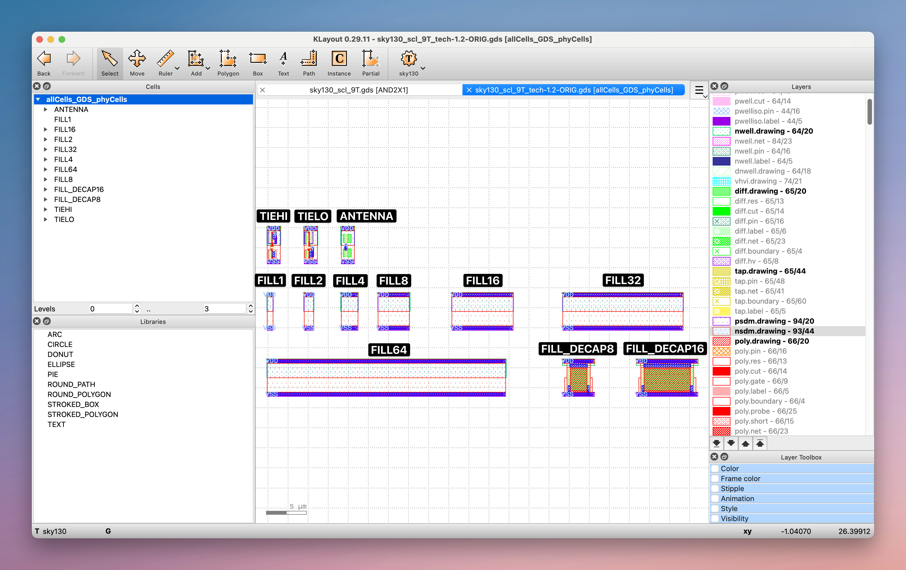

#### **Antenna Diodes & The Antenna Effect:**
* Antenna diodes are included to prevent the antenna effect that occures during fabrication.
    * Antenna Effect: an effect that occurs during the fabrication process that can render a die useless.
        * During manufacturing (specifically, [plasma etching](https://en.wikipedia.org/wiki/Plasma_etching), a form of [dry etching](https://en.wikipedia.org/wiki/Dry_etching)), charge is deposited onto metal lines/interconnects. These metal lines can be connected to the polysilicon gates of transistors and also can be left floating during parts of the manufacturing process before other upper metal layers are deposited.
      * These unconnected metal lines will sit there and collect charge throughout the manufacturing process.
      * Charge built up on these lines can suddenly discharge into the gate of the transistor, which causes gate oxide breakdown => broken transistor => broken chip.

      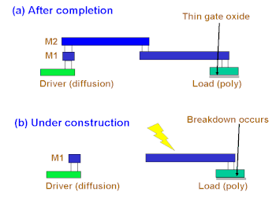
    * Antenna diodes are reverse biased diodes that leak charge to ground to prevent the charge from going into the transistor's gate.
        * This results in higher parasitic capacitance (resulting in a slower circuit) and higher leakage power (higher static power) on that net.

        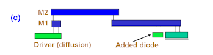

        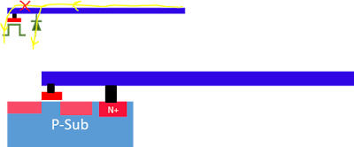
* Antenna violations are checked using a physical verification tool (Will discuss more during the DRC section) with a deck that has rules on the maximum allowed ratio between metal-interconnects to gate area allowed ("antenna ratio").
<!--TODO: LINK DRC SECTION-->
* Antenna diodes, for the most part, is automatically inserted by Innovus during the Place & Route flow. (See lines 42 & 43) of the TCL in the [Place & Route section](#4-tool-settings)

<details>
    <summary>Other ways to prevent the antenna effect</summary>
1. Metal Hopping / Jumper Insertion: Break the lengthy metal interconnect into small pieces using jumper interconnects/wires to other metal layers so that a piece of interconnect never gets lengthy enough to collect enough charge to break down the transistor's gate oxide.

* The advantage of this is avoiding the higher parasitic capacitance and leakage power associated with a diode, however, it comes at a cost of potentially more congestion in the upper metal layers of the design & an increase in the number of [Vias](#characterizing-the-entire-processtechnology-technology-lefs) between metal layers placed.

    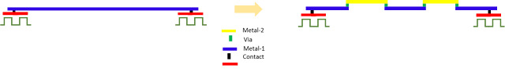

2. Dummy Transistor Insertion: Increase the effective gate area of the transistor by adding a dummy transistor next to the transistor that you originally placed. This decreases the ratio between metal-interconnects to gate area. The downsides of this is quite obvious: more dummy transistors = less area for useful logic + more power consumed.
    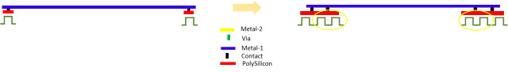
</details>


#### **Fill Cells & Digital Design Fill, Decoupling Capacitors:**
* Fill cells are often used to fill in the area in your digital design where there are no logic standard cells. By filling those empty spaces with filler cells, it ensures that all power nets throughout your circuit are connected.
* Fill cells have no logic in them. Although, sometimes the free area in a fill cell is used to add decoupling capacitors to a digital design.
    * _Decoupling capacitors_ help stabilize the power supply network. They store charge and respond to any sudden current requirements in the power delivery network. Without these capacitors [power droop](https://en.wikipedia.org/wiki/Voltage_droop) or [ground bounce](https://en.wikipedia.org/wiki/Ground_bounce) may occur and affect the constant power supply and as a result, power supplied to the standard cells.

* A design without fillers will likely result in (DRC) errors. Particularly if you fail to place fillers, it'll likely result in a `nwell minimum spacing not met` DRC violation. This is because of the Well Proximity Effect.
    * The result of the Well Proximity Effect is that doping level at the edges of [nwells](#skywater-130nm-stackup) tends to be different than the doping level at the middle of the nwell. This means, for consistency, we want to have as large of a nwell as possible, which is created through having devices sit right next to each other. ([More Information](https://analoghub.ie/category/Layout/article/layoutDependentEffects#WPE))

        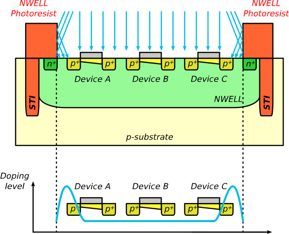

    * Having gaps in your design (due to a lack of filler cells) will result in chunks of different nwells throughout the design, which results in more devices sitting at the edge of nwells, and more devices suffering from this doping inconsistency.
   * It's also a headache for the fabrication house...
   (More masks to create space for the gaps in your design)

* NOTE: You might hear about a fill script or metal fill later in the signoff stage. Fill cells are not the same as this fill script or metal fill.

Design with Fill Cells:
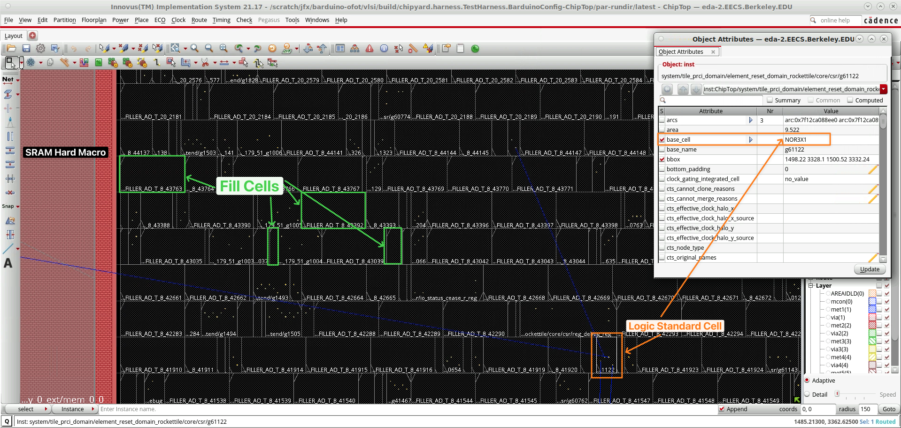

Design without Fill Cells:
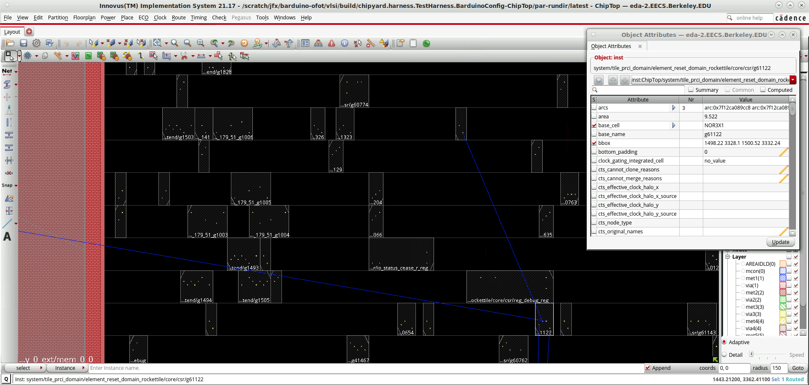

#### **Tie Cells:**
* Special purpose cells that outputs either high (TIEHI) or low (TIELO).
* We have these cells to act as the intermediary between the input and the gate of the transistor. We don't directly connect the input to the gate of transistors as supply ligthces can damage the transistor.
    * The power grid is connected through tie cells and the output of these tie cells are then connected to the gate of transistors.

#### **Tap Cells:**
* Tap cells are cells with no logic but they tie nwell to VDD and p-substrate to VSS.
* Without tap cells, a design can suffer from Latch Up, where a short-circuit is formed between the power supply rails, and once formed, it'll continue to short circuit in a positive feedback loop until device shutdown. Here's an example:

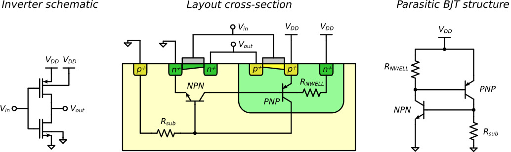
Let's take this inverter as an example. The Parasitic BJT structure is created and once $R_{NWELL}$ and $R_{sub} = R_{substrate}$ create enough voltage drop during a trigger event, the parasitic BJT structure turns on, then feedsback into itself, connecting VDD with ground until there is absolutely no current flowing through it -- which typically doesn't happen until the device is fully powered down. 

[More Information](https://analoghub.ie/category/Layout/article/layoutDependentEffects#Latchup)

The fix for this is to hold nwell to VDD and substrate to ground, so that voltage drop never happens and a positive feedback loop can never sustain itself. This is what tap cells do.

Some older Standard Cells have tap cells integrated into its logic standard cells, in which case you won't see a Tap Cell under its Physical Cells list. However, newer processes have moved the Tap Cell out to its own cell in order to save area in the logical standard cells.
* An additional set of (DRC) rules checks for latch-up compliance and tap cells are inserted as needed to resolve these violations. (Will discuss more during the DRC section).
<!--TODO: LINK DRC SECTION-->

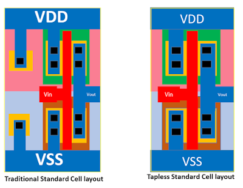

The Cadence SkyWater 130nm Standard Cells (SKY130_SCL) has built in tap cells in its logic standard cells.

#### **Power on Reset:**
* A block that generates a reset signal that propagates through the entire chip so everything is set to a predefined state. It is essentially a giant RC network:

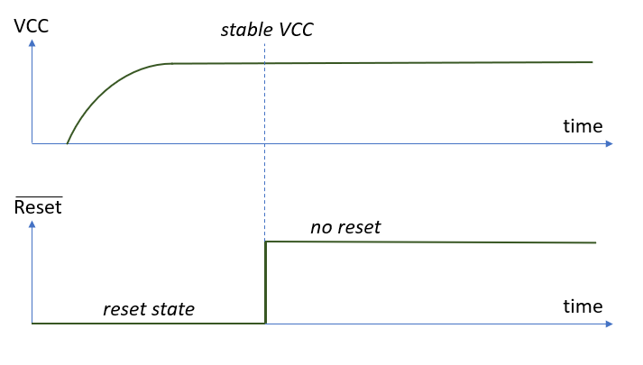
    
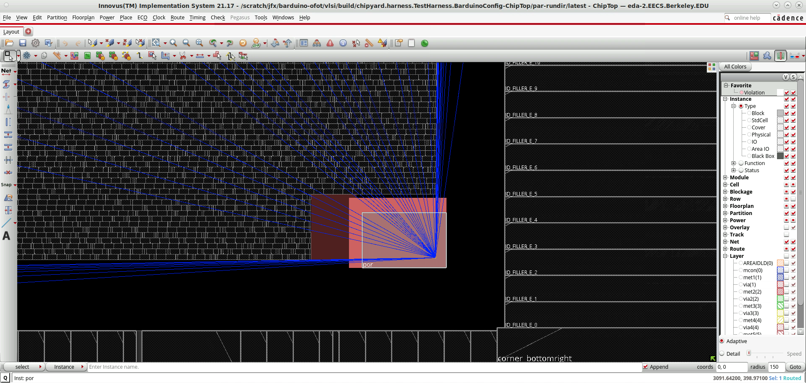
A PoR doesn't necessarily connect to all standard cells - Remember they don't have a reset signal! In this case it connects to almost all the IO Cells to reset inputs to our chip to a known state.


Note: You should ensure that you don't include the PoR in timing paths. (Why?^)

^: The PoR is not part of the timing of the chip; It'll likely always be the critical path as it is a signal that propagages through the entire chip.

### Characterizing the entire Process/Technology: Technology LEFs
Common other names of Technology LEFs: "Tech LEFs", ".tlefs"
* These contain information regarding the process as a whole (information about the stackup) -- diffusion layer, poly-silicon layer, metal interconnect information, Via information, possible placement sites ("classes") and their dimensions.
    * "information" = minimum spacing between metal lines, via width, spacing requirements, sheet resistance information for different metal layers and vias.

* Some concepts that you might find helpful to know:
    * `via`: Via is a hole in the dielectric layer that connects two metal layers. It is used to connect metal lines that are not adjacent to each other.
    * Metal layers have directional preferences - in this case, metal 1 prefers horizontal connections, while metal 2 prefers vertical connections.
    * For what the syntax of the Tech LEF means, see [the Cadence LEF/DEF Manual](https://drive.google.com/file/d/11f-7cCzddl_lga5LUSpBbYsDdlnHN7bO/view?usp=drive_link)

> [!CAUTION]
> UNDER NO CIRCUMSTANCES SHOULD YOU COPY AND REDISTRIBUTE CADENCE MANUALS. YOU ARE FREE TO DOWNLOAD THEM IF NEEDED, BUT LIMIT SHARING TO THE BARE MINIMUM. DO NOT SHARE WITH ANYONE NOT AFFILIATED WITH UC BERKELEY.


The technology LEF for the SkyWater 130nm Process can be found at `/home/ff/ee198/ee198-20/sky130_col/sky130_scl_9T_0.1.2/sky130_scl_9T_tech/lef/sky130_scl_9T.tlef`. Take a look!


# Theory: Packaging Overview & Chip I/O
> This section is largely taken from the old EECS151Tapeout Lab 5, written by Elam Day-Friedland.

In order to interact with the outside world (as most useful chips do), we need to define an interface between the internal nets of an SoC and the 'nets' (usually PCB traces or discrete wires) external to it.
This interface is realized through the use of so-called "IO" (input/output) cells on the SoC that are, through the SoC's [package](https://en.wikipedia.org/wiki/Integrated_circuit_packaging), exposed to the outside world.

**[Gradescope] Identify a property that might be useful in an IO cell that wouldn't be necessary in a non-IO cell.** (Hint: think about what scary or non-standard things come from off-chip!)

IO on a chip comes in two major flavors: pads and bumps.
Pads are connected to the package via wire bonds, whereas a chip with bumps can either be wire-bonded or "flipped" and directly soldered onto the package substrate (a substrate is essentially a PCB with tighter tolerances).
Check out the lecture on manufacturing to learn more!
You can find the lecture folder [here](https://drive.google.com/drive/folders/1g8HB1NtqkX3s_v_RFG-lzUnx5HByMj9o).
Below is a visual idea of the differences between pads and bumps.

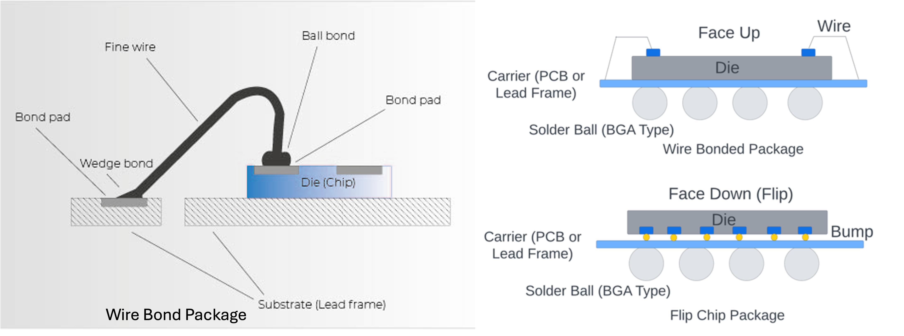

For older processes, chips tend to be wirebonded, for more advanced processes/technologies, flip-chip bonding with bumps is more common.
    * For SkyWater 130nm chips are wirebonded, however for a more advanced process like TSMC 16, chips are flip-chip bonded with bumps.

# Applied: Cadence SKY130nm MPW Tapeout Area, I/O Specifications 
> This section is largely taken from the old EECS151Tapeout Lab 5, written by Elam Day-Friedland.

For the SkyWater 130nm tapeout, we will be using a ring of pads (a "pad ring") that surrounds our chip.
This strategy is both convenient to wire-bond to and allows us to have a contiguous IO ring for our chip supplies, visualized below.


## IO Cell Library

Just like designers (or, more accurately, CAD tools) use a standard cell library for implementing digital logic,
we will use an IO library to implement our design's interface to the outside world.

We will be using the Sky130 IO library [sky130_ef_io](https://github.com/RTimothyEdwards/open_pdks/tree/master/sky130/custom/sky130_fd_io),
which is an Efabless (RIP :() addendum to the SkyWater I/O library [sky130_fd_io](https://skywater-pdk.readthedocs.io/en/main/contents/libraries/sky130_fd_io/docs/user_guide.html#i-o1-common-features).

Warning: the sky130\_fd_io documentation may be inconsistent or out of date with what's used.
We're confused too a lot of the time- a lot of configuration is set up over many iterations of trial-and-error (and slacking people who've tried and error-ed before).
That's the beauty of abstraction!
Once an opaque configuration issue has been solved, its solution can be easily integrated into others' projects.

One important functionality that the IO cell layout provides is [ESD](https://en.wikipedia.org/wiki/Electrostatic_discharge) protection.
This is particularly critical when these pins will be connected to unknown (and potentially dangerous) sources of electricity from the outside world.
Even though your IO cells have ESD protection, you should still ground yourself when working on them!
There's nothing worse than frying a chip because you didn't feel like putting on a cool [bracelet](https://www.amazon.com/iFixit-Anti-static-Wrist-Strap-Adjustable/dp/B00B2T9C8Y) when working on it :(.
These 'ESD clamps' are effectively diodes that shunt high voltage spikes to be absorbed by the power rails, instead of your thin signal routing.

The library contains many GPIO cells, but here are a couple of particular interest
* `sky130_ef_io__gpiov2_pad_wrapped` is the default, workhorse digital pad. They have a spec-ed bandwidth of 66MHz (see the Sky130 IO Library docs linked above for more specs), and are generally what we use in standard SoC design
* `sky130_ef_io__analog_pad_esd2` provides an analog interface to the outside world and support potentially higher bandwidth digital systems (although they require custom drivers/receivers)

In addition to signal pads, we need to connect supply busses (rails). Here are the busses supported by this IO library (i.e. nets present in the IO ring):

* VDDIO: an (optionally isolated) supply for off-chip interactions (i.e. to supply the IO pad drivers)- generally 3.3v (although it can be set to 1.8)

* VSSIO: an (optionally isolated) ground for I/O interactions

* VDDA: an (optionally isolated) supply for on-chip analog devices

* VSSA: an (optionally isolated) ground for on-chip analog devices

* VCCD: an (optionally isolated) supply for on-chip digital devices (generally 1.8v, the VDD of the default transistors in sky130)

* VSSD: an (optionally isolated) ground for on-chip digital devices

Remember that VSS means ground (0v) and VDD/VCC is the supply (i.e. usually max) voltage of the region it supplies.

**[Gradescope] You'll notice that these supplies are optionally isolated.
Even if, for example, VDDA and VCCD had the same voltage, why might we still want to isolate them?**

`sky130_fd_io` uses overlays (i.e. added wires) on top of generic power/ground cells to determine which supply trace on the power ring to connect a given IO pad to.
`sky130_ef_io` has pre-defined overlay + generic cells, such as `sky130_ef_io__vccd_lvc_clamped3_pad`.
Thanks, Efabless!

As we will see, Innovus needs special instructions to place these power cells, since they aren't explicitly instantiated through `IOBinder`s as signal IO cells are (see the following section for an introduction to `IOBinder`s).

## IOs in Chipyard (Elaboration + Synthesis)
In order for our design to utilize the IO cells discussed above, they must instantiated (along with what they connect to) in the netlist (i.e. in the RTL).
Chipyard uses functions called [IOBinder](https://chipyard.readthedocs.io/en/stable/Customization/IOBinders.html)s to instantiate IO cells and connect them to internal SoC signals.
You can find wrappers defined for the sky130\_ef_io cells we'll use in `generators/chipyard/src/main/scala/sky130/Sky130EFIOCells.scala` within your Chipyard repo.
Check out `Sky130EFIOCellTypeParams` for instantiations of the cells that could be used by our design (`analog`, `gpio`, etc.).

Take a look at the `HasSky130EFIOCells` trait that's included in `WithSky130ChipTop`, which our `OFOTConfig` uses.
This is where the magic happens: for each `toplevel` port (ports are created by fragments in the config such as `WithUARTAdapter`), an `iocell` is instantiated, registered and connected to the port.
This allows the concept of 'toplevel' ports in RTL to be decoupled from how they are realized (by being mapped to a physical IO cell for physical design, for example). 

**[Gradescope] IO Cells aren't the only thing ports map to! What's a use-case aside from physical design for these port objects?** (hint: think simulation)

## IO Maps in Innovus (Physical Placement)

We need to tell our place-and-route tool (here, Innovus) where to put the IO cells for the signals we've attached `IOBinder`s to as well as, where to put power pads to bring power to our IO ring.
We do this through an "IO map", generated by a script called `gen-io-file.py`, located in `vlsi/scripts`.
An "IO map" in Innovus is a list of io cell nets and their placement coordinates.
The map also includes cell names (such as the `sky130_ef_io__vccd_lvc_clamped3_pad` mentioned above) when they aren't inferable from the RTL.
This occurs, for example, with power pads which aren't explicitly instantiated in the RTL.
It takes in a yml of the desired IO configuration (which cells to put where),
and is executed by `vlsi/Makefile` as a dependency for the flow when the `IS_TOP_RUN` variable is true.
The `IS_TOP_RUN` variable in `vlsi/Makefile` decides when to generate this IO map,
and is set to `1` by default but is disabled for `tutorial=sky130-commercial` flows, since they do not need IO pads.
In addition to placing signal (and extra, such as filler) IOs based on the yml,
the script also generates IO placements for the supply busses, so we can provide VCCD VSSD, etc. to our chip.

**[Gradescope] Give the path to the yml that gen-io-file.py is looking for (hint: look in the `Makefile`). What would you have to add if you increased the Serial TileLink bus width?**

Once you've run `make CONFIG=OFOTConfig par`, you should see an `io_map.io` file in your `vlsi/build/<config>`.
Open it up, and take a look inside!
You'll notice that signal `inst`s don't have explicit `cell`s attached (just a placement),
since the RTL already provides a reference to the cell,
whereas supply cells do,
since they will be inserted manually.

**[Gradescope] What's the point of placing corner/filler IO cells? They don't provide any pads/IO...**

# Theory: Inputs/Outputs of each VLSI Step
We've heard about the different tools for each step... What do these tools take in terms of input & what do they output? This section should help you understand flow of how your design goes from RTL to a GDS.

A thing to keep in mind: These tools are controlled by a scripting language called TCL (pronounced "tickle"). Each tool has its own set of commands that can be called within a TCL file. These commands are the primary way digital designers control these VLSI tools. These commands look like terminal commands where you have a command like `cp`, followed by some flags and arguments. TCL files have the file extension `.tcl`. We will talk about how to write TCL to control these tools in a later section; this is just a heads up so you don't get confused when you see these commands in the following few sections.

## Synthesis
Broadly, synthesis follows the following flow:

If you would like some code as reference, the synthesis TCL script can be found at the following location (after running synthesis at least once):
`${CY}/vlsi/build/chipyard.harness.TestHarness.<your config>-ChipTop/syn-rundir/syn.tcl`

### 1. Write/Generate SDCs
SDCs or Synopsys Design Constraint files should either be manually written or generated by some tool.

SDC files contain design timing information (special cases, restrictions, etc), creation of clocks (and clock dividers, clock inverters, etc), I/O pin constraints such as defining external load capacitance connected to a top level port, among other things. (For more detail, read [this](https://signoffsemiconductors.com/introduction-to-sdc/)).


<!-- TODO: give example of actual hammer yaml -->
At Berkeley, we have a tool called [Hammer](https://hammer-vlsi.readthedocs.io/) that generates the SDC commands for us, and automatically writes them to a SDC file according a some specifications we defined in a [YAML](https://en.wikipedia.org/wiki/YAML#Example) configuration file. We will discuss Hammer in a later section, but if you are curious, the source code that generates these SDC commands is [here](https://github.com/ucb-eecs151tapeout/ofot-hammer/blob/0f5388ed185e52254bfabe7c127b73aedfd26d90/hammer/vlsi/hammer_vlsi_impl.py#L2183-L2284).

You can find the SDCs your synthesis process used at `${CY}/vlsi/build/chipyard.harness.TestHarness.<someConfig>-ChipTop/syn-rundir/clock_constraints_fragment.sdc` and `${CY}/vlsi/build/chipyard.harness.TestHarness.<someConfig>-ChipTop/syn-rundir/pin_constraints_fragment.sdc`

### 2. Write/Generate MMMC (Multi-mode, Multi-corner) Views, then read in MMMC files
The process of doing this at a high level is:
1. Read SDC Files
2. Read in `.lib` files
3. Create MMMC corners

MMMC Corners: Multi-mode, Multi-corner views attempt to cover all real world environments where your chip may be used in, then provide this information to the tool, so it can accurately provide timing information.
Modes are defined by different functional modes that your chip will operate in (high-performance, low-power, etc.) -- This is reflected by different supply voltages and timing constraints.
Corners represent a set of data that attempts to capture variations in the manufacturing process (specifically higher and lower carrier mobilities in NMOS & PMOS -- Read more [here](https://en.wikipedia.org/wiki/Process_corners#FEOL_corners)) and how they will impact performance of the chip, along with how variations in voltage and temperature of the surrounding environment that your chip will operate in will change timing and other parameters.

You can find the script that your synthesis run used to generate MMMC corners at `${CY}/vlsi/build/chipyard.harness.TestHarness.<someConfig>-ChipTop/syn-rundir/mmmc.tcl`

### 3. Read in LEF files
LEF files includes rules and specifications about the standard cells and metal interconnects. Both Standard Cell LEFs and Technology LEFs are read in at this stage.

If you are not sure what these terms mean, refer to the [Characterizing a Standard Cell: Describing it to the VLSI tools](#characterizing-a-standard-cell-describing-it-to-the-vlsi-tools) and [Characterizing the entire Process/Technology: Technology LEFs](#characterizing-the-entire-processtechnology-technology-lefs) sections.

### 4. Read in RTL
This step is pretty simple: the synthesis tool reads in all of the RTL that makes up your design! One of these files should be your top-level Verilog file.

### 5. Sanity Checks
The tool then runs a sanity check on the design and timing specifications.
This involves making sure that there is no combinational loops, multidriven nets, etc and that there are no missing clock definitions, missing information for the I/O ports, multi-clock driven registers, etc.

### 6. Generic Mapping
In EECS151 Lab 3's words:
> This step is the generic synthesis step. In this step, [the synthesis tool] converts our RTL read in the previous step into an intermediate format, made up of technology-independent generic gates. These gates are purely for gate-level functional representation of the RTL we have coded, and are going to be used as an input to the next step. This step also performs logical optimizations on our design to eliminate any redundant/unused operations.

For Cadence Genus, this step is identifiable by the command `syn_generic` being run.

### 7. Technology Mapping
> This step is the mapping step. [The synthesis tool] takes its own generic gate-level output and converts it to [technology]-specific gates. This step further optimizes the design given the gates in our technology. That being said, this step can also increase the number of gates from the previous step as not all gates in the generic gate-level Verilog may be available for our use and they may need to be constructed using several, simpler gates.

For Cadence Genus, this step is identifiable by the command `syn_map` being run.

### 8. Optimization
Optional step, where the TCL command `syn_opt` is called for the tool to perform some further optimizations.

### 9. Add Tieoffs
> In some designs, the pins in certain cells are hardwired to 0 or 1, which requires a tie-off cell. This step adds these cells.

Here is an example of the TCL script telling Cadence Genus which gates/standard cells are to be used for tieoff, and then calling Genus to add the tieoffs:

```
set HI_TIEOFF [get_db base_cell:TIEHI .lib_cells -if { .library.library_set.name == $ACTIVE_SET }]

set LO_TIEOFF [get_db base_cell:TIELO .lib_cells -if { .library.library_set.name == $ACTIVE_SET }]

add_tieoffs -high $HI_TIEOFF -low $LO_TIEOFF -max_fanout 1 -verbose
```

### 10. Generate Reports
> Generates post-synthesis reports on area, utilization, timing, runtime, etc

Note: Most of these reports will not be particularly accurate since they don't take into account routing congestion, wire delay, clock tree delays and clock skew, which the Place & Route flow takes into account. So post-synthesis reports should be used for a ball park reference only.

### 11. Write outputs
Writes the results of the synthesis flow. This includes gate-level Verilog, a SDC file for the post-synthesis design, a .sdf (Standard Delay Format) file containing timing information (path delays, timing constraints for checks)

Here is the TCL (note, paths are different here) for writing the 3 different output files:

```
write_hdl > ${CY}/vlsi/build/chipyard.harness.TestHarness.<your config>-ChipTop/syn-rundir/ChipTop.mapped.v

write_sdc -view ss_100C_1v60.setup_view > ${CY}/vlsi/build/chipyard.harness.TestHarness.<your config>-ChipTop/syn-rundir/ChipTop.mapped.sdc

write_sdf > ${CY}/vlsi/build/chipyard.harness.TestHarness.<your config>-ChipTop/syn-rundir/ChipTop.mapped.sdf
```

You can view the 3 written files at the file paths above as specified in the TCL script.

## Place & Route

Continuing from synthesis, here is what is involved in the Place & Route process:

The reference TCL script is available here: `${CY}/vlsi/build/chipyard.harness.TestHarness.<your config>-ChipTop/par-rundir/par.tcl`

This section will heavily rely on you reading [EECS151 ASIC Lab 4's Place and Route section](https://github.com/EECS150/asic-labs-sp24/tree/main/lab4#place-and-route). If you haven't read it before or forgot the contents, please re-read it.

### 1. Read LEFs
* Reading in Standard Cell & PDK LEFs - See [this section](#3-read-in-lef-files).

### 2. Read MMMC
* See [this section](#2-writegenerate-mmmc-multi-mode-multi-corner-views).

### 3. Init Design
Initializes the design with context of your synthesized Verilog netlist, LEF, name of power net, name of ground net, CPF file, MMMC file.

### 4. Tool Settings
A series of commands that tell Innovus to behave a certain way during the flow (when it runs placement, optimization, CTS, routing, etc).

<details>
<summary>Here is the TCL for your reference:</summary>

```
1     ##########################################################
2     # Placement attributes  [get_db -category place]
3     ##########################################################
4     #-------------------------------------------------------------------------------
5     set_db place_global_place_io_pins  true
6
7     set_db opt_honor_fences true
8     set_db place_detail_dpt_flow true
9     set_db place_detail_color_aware_legal true
10     set_db place_global_solver_effort high
11     set_db place_detail_check_cut_spacing true
12     set_db place_global_cong_effort high
13     set_db place_detail_use_check_drc true
14     set_db place_detail_check_route true
15     set_db add_fillers_with_drc false
16
17     ##########################################################
18     # Optimization attributes  [get_db -category opt]
19     ##########################################################
20     #-------------------------------------------------------------------------------
21
22     set_db opt_fix_fanout_load true
23     set_db opt_clock_gate_aware false
24     set_db opt_area_recovery true
25     set_db opt_post_route_area_reclaim setup_aware
26     set_db opt_fix_hold_verbose true
27
28     ##########################################################
29     # Clock attributes  [get_db -category cts]
30     ##########################################################
31     #-------------------------------------------------------------------------------
32     set_db cts_target_skew 0.03
33     set_db cts_max_fanout 10
34     #set_db cts_target_max_transition_time .3
35     set_db opt_setup_target_slack 0.10
36     set_db opt_hold_target_slack 0.10
37
38     ##########################################################
39     # Routing attributes  [get_db -category route]
40     ##########################################################
41     #-------------------------------------------------------------------------------
42     set_db route_design_antenna_diode_insertion 1
43     set_db route_design_antenna_cell_name "ANTENNA"
44
45     set_db route_design_high_freq_search_repair true
46     set_db route_design_detail_post_route_spread_wire true
47     set_db route_design_with_si_driven true
48     set_db route_design_with_timing_driven true
49     set_db route_design_concurrent_minimize_via_count_effort high
50     set_db opt_consider_routing_congestion true
51     set_db route_design_detail_use_multi_cut_via_effort high
```

</details>

You most likely won't know what each individual command does -- and that is OK! We as staff don't even remember. Luckily there is a manual that tells you what these things do. We will cover how to read this (very long) manual in the [TCL Scripting Applied] Section.

### 5. Read Power intent
> Reads in CPF file [Common Power Format] A CPF file contains information about power domains in the design (voltage, names, groups, etc)

You can take a look at the CPF that our flow reads in at `${CY}/vlsi/build/chipyard.harness.TestHarness.<your config>-ChipTop/par-rundir/power_spec.cpf` after your first Place & Route run. You will see that it is creating different power nets (1.8v, 3.3v), connecting IO cells that take in power to the correct power domains, assigning specific IO cell pins to different power nets.

### 6. IO Fillers
For our IC design, I/O cells are found at the {top, left, right, bottom} edges of the chip in order to allow our chip to interface with the outside world.

^ If this concept is foreign to you, see the first photo in the [Floorplanning section of EECS151-LA Lab 4](https://github.com/EECS150/asic-labs-sp24/tree/main/lab4#floorplanning).

However, it is not a great idea to have our I/O cells directly touching each other (exercise for the reader: why?*). So we need to insert special "I/O fillers" between the different I/O cells. What this exactly looks like on our chip is best illustrated with photos:

1. Overview of our entire chip/"die" (just to give you some context -- this view should be familiar to you already from EECS151 ASIC Lab 4)


2. If you look towards the left of the photo & we zoom in, you can see the IO cells and IO fillers and how they fit together:


\*: Electrically speaking, it makes keeping the circuitary of each IO cell separate a lot more difficult, and this may result in unintended shorts, unintended crossing of power domains, etc. From a physical perspective, having each IO port be so close to the other ones can cause problems/difficulty when we attempt to connect wires to the chip to interact with the other components off chip. We'll discuss more how exactly our chip is connected with components off chip in the [die area, io rings, available area, packaging overview] section.

### 7. Add Core (Power) Rings to Chip
We then draw a ring around our chip, between the actual wires/logic and our IO cells. This ring carries power and ground signals around the chip, so that we can use it as a source for when we draw our horizontal and vertical power straps across our chip. We will talk about why we need these horizontal & vertical power straps in the next section, but the tl;dr is: it enables us to get power to each standard cell, or logic that requires power.

Conceptual photo, the ring that is labeled "Rings" is what this step of P&R draws:


Here is a photo from an actual SkyWater 130nm design that shows the Core Ring, how power is fed into it and how power is drawn from it for the rest of the chip's logic:


### 8. Draw power straps
In the previous step we drew the power ring, which are the sources of power and ground for all the standard cells in the design. However, drawing wires to every cell from the ring would cause voltage drop (IR Drop) which causes noise for the VDD and Ground signals of each cell{edit this explanation of IR Drop and probably add more detail}. To prevent this, we place horizontal and vertical straps across the rings to distribute power and ground evenly and minimize the effects of IR Drop. Using Hammer, power straps are generated given user parameters in the .yml configuration of the technology(this case sky130.yml). The commands for Innovus to create the power straps is found it its own TCL file called power_straps.tcl which specifies the metal layers, spacing, and width of the straps, etc.  

${CY}/vlsi/build/chipyard.harness.TestHarness.<your config>-ChipTop/par-rundir/power_straps.tcl

<details>
<summary>Here is the TCL for your reference:</summary>

    1   reset_db -category add_stripes
    2   set_db add_stripes_stacked_via_bottom_layer met1
    3   set_db add_stripes_stacked_via_top_layer met1
    4   set_db add_stripes_spacing_from_block 4.000
    5   add_stripes -pin_layer met1 -layer met1 -over_pins 1 -master "sky130_fd_sc_hd__tapvpwrvgnd_1" -block_ring_bottom_layer_limit met1 -block_ring_top_layer_limit met1 -pad_core_ring_bottom_layer_limit met1 -pad_core_ring_top_layer_limit met1 -direction horizontal -width pin_width -nets { VSS VDD }
    6
    7   reset_db -category add_stripes
    8   set_db add_stripes_stacked_via_top_layer met2
    9   set_db add_stripes_stacked_via_bottom_layer met1
    10   set_db add_stripes_trim_antenna_back_to_shape {stripe}
    11   set_db add_stripes_spacing_from_block 4.000
    12   add_stripes -create_pins 0 -block_ring_bottom_layer_limit met2 -block_ring_top_layer_limit met1 -direction vertical -layer met2 -nets {VSS VDD} -pad_core_ring_bottom_layer_limit met1 -set_to_set_distance 82.80 -spacing 2.26 -switch_layer_over_obs 0 -width 0.96 -area [get_db designs .core_bbox] -start [expr [lindex [lindex [get_db designs .core_bbox] 0]
    13   add_stripes -create_pins 0 -block_ring_bottom_layer_limit met2 -block_ring_top_layer_limit met1 -direction vertical -layer met2 -nets {VSS VDD} -pad_core_ring_bottom_layer_limit met1 -set_to_set_distance 82.80 -spacing 2.26 -switch_layer_over_obs 0 -width 0.96 -area [get_db designs .core_bbox] -start 3328.0
    14
    15   reset_db -category add_stripes
    16   set_db add_stripes_stacked_via_top_layer met3
    17   set_db add_stripes_stacked_via_bottom_layer met2
    18   set_db add_stripes_trim_antenna_back_to_shape {stripe}
    19   set_db add_stripes_spacing_from_block 2.000
    20   add_stripes -create_pins 0 -block_ring_bottom_layer_limit met3 -block_ring_top_layer_limit met2 -direction horizontal -layer met3 -nets {VSS VDD} -pad_core_ring_bottom_layer_limit met2 -set_to_set_distance 14.96 -spacing 3.62 -switch_layer_over_obs 0 -width 1.14 -area [get_db designs .core_bbox] -start [expr [lindex [lindex [get_db designs .core_bbox] 0
    21
    22   reset_db -category add_stripes
    23   set_db add_stripes_stacked_via_top_layer met4
    24   set_db add_stripes_stacked_via_bottom_layer met3
    25   set_db add_stripes_trim_antenna_back_to_shape {stripe}
    26   set_db add_stripes_spacing_from_block 2.000
    27   add_stripes -create_pins 0 -block_ring_bottom_layer_limit met4 -block_ring_top_layer_limit met3 -direction vertical -layer met4 -nets {VSS VDD} -pad_core_ring_bottom_layer_limit met3 -set_to_set_distance 20.24 -spacing 4.58 -switch_layer_over_obs 0 -width 1.86 -area [get_db designs .core_bbox] -start [expr [lindex [lindex [get_db designs .core_bbox] 0]
    28
    29   reset_db -category add_stripes
    30   set_db add_stripes_stacked_via_top_layer met5
    31   set_db add_stripes_stacked_via_bottom_layer met4
    32   set_db add_stripes_trim_antenna_back_to_shape {stripe}
    33   set_db add_stripes_spacing_from_block 2.000
    34   add_stripes -create_pins 1 -block_ring_bottom_layer_limit met5 -block_ring_top_layer_limit met4 -direction horizontal -layer met5 -nets {VSS VDD} -pad_core_ring_bottom_layer_limit met4 -set_to_set_distance 61.2 -spacing 18.4 -switch_layer_over_obs 0 -width 5.4 -area [get_db designs .core_bbox] -start [expr [lindex [lindex [get_db designs .core_bbox] 0]

</details>

### 9. Place IO Cells, Promote Top Level I/O Pins
As we discussed before, there is an IO Cell library which provides all the cells that map to a different signal pads for signal buses(VDD, VSS, etc), GPIO and power. This step focuses on the placement of these IO cells within the IO ring given specific placement constraints which are defined in the IO Binder. Power pads have specific placement coordinates in the pad .

In verilog, every module has input ports/signals(ex: clk, rst, uart, etc) that connect the module to other modules or the real world. In an hierarchical design, the module at the top of the hierarchy gets their input pins on the core be "promoted" to be connected to the IO pad ring. 

### 10. Place Opt Design
Given all the standard cells provided in the synthesized netlist, Innovus performs many algorithms to place the standard cells together based on design constraints in order to meet timing, avoid congestion, and provide clear access to pins. In the placement stage, there are hard and soft constraints for hard macro blocks and the standard cells. Hard constraints must be satisfied and are typically tied to the placement location of hard macros. Soft constraints are preferences that can be violated as they provide guidance in the optimization placement. The floorplan provides the core area which constrains all the logic to be inside the fence of the IO ring. The SDC files provide the timing information which how close standard cells and logic need to placed together to meet timing. In addition, standard cells will be made sure to not be placed too close together to prevent congestion of the wires as wires being too close together leads to cross talk which is where the magnetic field of the current of a nearby wires affects the signal integrity of other wires.  

### 11. Set CTS Buffer & Clock Gating Cells, Perform CTS (ccopt_design)
Clock Tree Synthesis(CTS) is process of distributing the clock signal to all flip flops in the design as evenly as possible so the clock received at every leaf is the same. This is to prevent clock skew and reduce the likelihood of setup and hold time violation in order to meet timing constraints. Lab 4 of the 151 ASIC labs covers this topic and it is recommended to read the CTS section in that lab spec. Innovus uses algorithms to place and route the clock tree across the chip and optimizes based on clusters of sequential logic and uses Buffer cells to balance the delay between different leaves by decreasing delay. Clock gating cells are special cells in CTS that control whether the clock signal is distributed to active parts of the chip. Clock gating is important for reducing power(specifically dynamic power) and its placement is optimized to meet timing during the CTS process. 

### 12. Route Design
Performs routing of all the standard cells and macros together. There are two main steps in the route design process, global and detail routing. 

Global routing: Determines the high-level topology between blocks that satisfies timing constraints while minimizing congestion and wirelength. During global routing, routing resources such as tracks and vias are allocated, and preliminary wire segments are laid out.

Detail Routing: Focuses on routing individual interconnections within the routing channels defined during global routing. Detail routing algorithms consider factors such as wire width, spacing, and via minimization to optimize routing density and signal integrity. 

### 13. Opt Design
Optimizes the design post routing with the exact measurements for the wires to calculate parasitic resistance and capacitance of the nets. Given this information, Innovus can rerun timing analysis and perform more optimizations to meet timing constraints and fix setup and hold time violations through resizing standard cells or adding buffers. 

### 14. Add Fillers
As mentioned before, filler cells are essential to the manufacturability to prevent DRC errors and power stability across the chip through adding decoupling capacitors. This step places all filler cells to fill in gaps of the design and add decoupling capacitors to certain areas of the chip for power stability. 

<details>
<summary>Here is the TCL that places Layer Fill for your reference:</summary>
    1   set_db add_fillers_cells "FILL_DECAP8 FILL_DECAP16 FILL1 FILL2 FILL4 FILL8 FILL16"
    2   add_fillers -base_cells "FILL_DECAP16" -area "263 3415 3341 4936" -density 0.1
    3   add_fillers -base_cells "FILL_DECAP16" -area "1512 300 3318 3500" -density 0.15
    4   add_fillers -base_cells "FILL_DECAP16" -area "1010 300 1521 3024" -density 0.2
    5   add_fillers -base_cells "FILL_DECAP16" -area "264 300 1030 819" -density 0.2
    6   add_fillers -base_cells "FILL_DECAP16" -area "272 820 444 3455"
    7   add_fillers -base_cells "FILL_DECAP16" -area "743 3090 1189 3394"
    8   add_fillers -base_cells "FILL_DECAP16" -area "62 300 3541 600" -density 0.15
    9   add_fillers -base_cells "FILL_DECAP16" -area "2818 660 3480 5033" -density 0.15
   10   add_fillers -base_cells "FILL_DECAP16" -area "62 4372 2500 5082" -density 0.15
   11   add_fillers -base_cells "FILL_DECAP16" -area "62 3380 772 4261" -density 0.15
   12   set_db add_fillers_cells "FILL1 FILL2 FILL4 FILL8 FILL16"
   13   add_fillers
<details>


### 15. GDS Stream Out
The final design is exported in a GDS(or GDSII) file format which is a graphical representation of the chip with all the standard cells, wires, vias, etc stacked on top of each other on different metal and via layers as seen on the stackup. This is the file that is distributed to the foundry to be manufactured as it acts as the blue print of the chip. While receiving the GDS may seem like the end of physical design, it is necessary to undergo more stages of physical verification to be certain that the final design is manufacturable and logically accurate. This includes the process of Design Rule Checking(DRC) and Layout Versus Schematic(LVS) analysis to later signoff and send the finalized GDS on the shuttle. 


## DRC


## LVS
